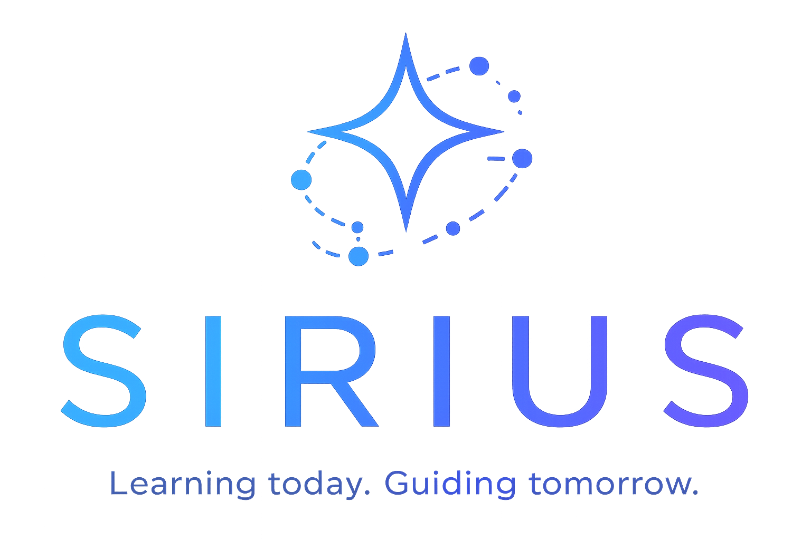

  

## GID 2026.1 - **AI & RnD Team Practice Project**

CV-aware RAG assistant: Ingest → Process → Retrieve → Generate.

| Layer | Stack | Path |
|-------|-------|-----|
| Frontend | React.js + Vite | `frontend/` |
| Backend | FastAPI | `server/app/` |
| Authentication | EXPA OAuth | `server/app/routes/auth,.py` |
| LLM Provider | Google Gemini | `server/app/services/gemini_client.py` |
| Vector DB | Pinecone | `server/app/database.py` |
| PostgreSQL DB | Supabase | `server/app/services/supabase_client.py` |